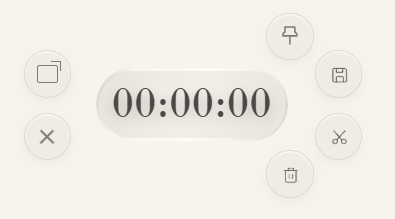
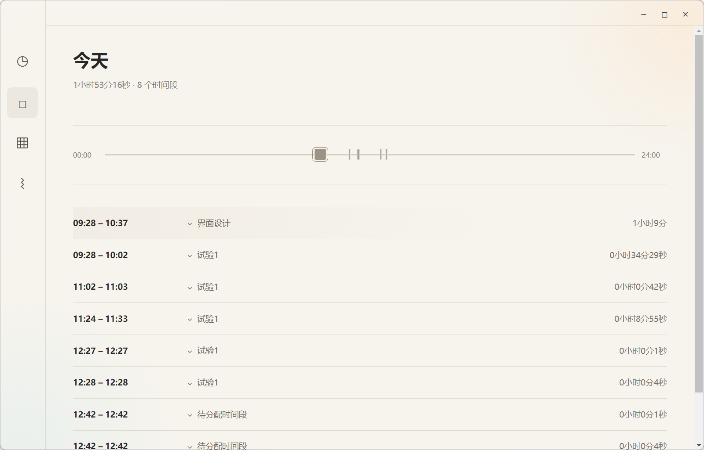
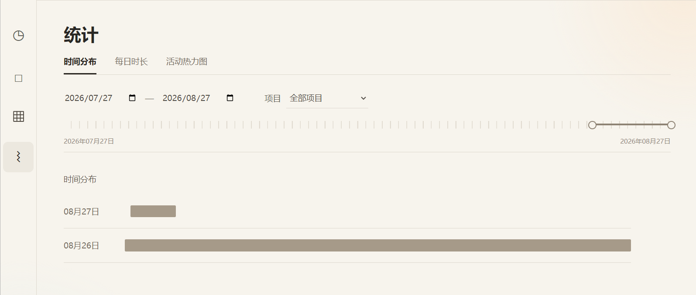

# 百万拳时间

一个本地优先的 Windows 专注计时与项目管理工具。无需账号、无需联网；项目、时间段和统计数据默认只保存在你的电脑上。

## 下载与安装

前往仓库的 [Releases](../../releases) 页面下载最新的 `百万拳时间 Setup.exe`。

1. 双击安装包。
2. 在安装向导中选择安装位置；不想继续时可随时点击“取消”。
3. 安装完成后，从开始菜单或桌面打开“百万拳时间”。

> 当前发布版本面向 Windows 10 / 11 64 位系统。普通使用者无需安装 Node.js、pnpm 或其他开发工具。

## 主要功能

- **专注计时**：支持秒表、倒计时、暂停、截取、保存和作废当前时间段。
- **项目管理**：支持多层级项目目录、重命名、说明编辑、归档与恢复。
- **时间归属**：时间段可先保持未分配，再关联到任意项目；项目选择器与项目目录实时同步。
- **数据统计**：查看今日时间线、项目累计时长、时间分布、每日时长和活动热力图。
- **专注体验**：提供专注态与悬浮计时窗口，保存或废弃时间段后仍保持当前专注界面。
- **本地数据**：使用 SQLite 保存数据，支持导出完整 JSON 备份；不依赖云端账号。

## 悬浮与收缩计时

当你希望在其他窗口中继续工作时，可以将计时器切换到悬浮态：展开时可快速置顶、保存、截取或作废当前时间段；收缩后只保留轻量计时条，尽量减少对当前任务的打扰。两种状态共享同一份计时数据，切换不会中断正在进行的专注。

| 悬浮态操作 | 收缩计时条 |
| --- | --- |
|  |  |

## 数据与隐私

应用数据只保存在当前 Windows 用户目录中，不会上传到第三方服务。卸载应用不会自动删除你的项目和时间记录；如需迁移设备，建议先在应用中导出 JSON 备份。

## 界面截图

### 今日时间线

按 00:00–24:00 的完整尺度查看当日专注记录，并在下方快速浏览每个时间段的归属与时长。



### 项目主页

以项目目录管理工作内容，集中查看项目累计时间、项目说明和最近记录。


### 时间统计

按日期和项目筛选时间分布，快速了解时间投入。



## 从源码构建（开发者可选）

如果你希望研究或复现该项目，需要 Node.js 22.5+ 与 pnpm：

```bash
corepack enable
pnpm install
pnpm run build:desktop
```

构建完成后，Windows 安装包将生成在 `release/` 目录。开发数据、构建缓存和依赖目录均不会提交到 Git 仓库。

## 技术栈

Electron 38 · Vite · JavaScript · Node.js · SQLite · NSIS
